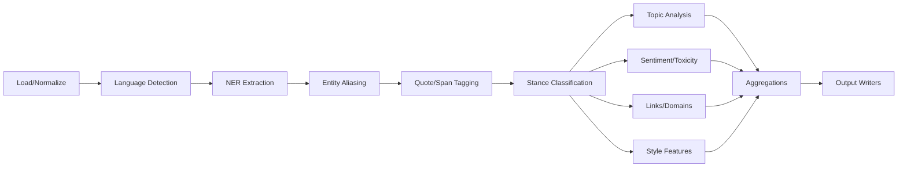

# WARP.md

This file provides guidance to WARP (warp.dev) when working with code in this repository.

## Overview and Guiding Principles

This is a **neutral, reproducible analytics pipeline** for analyzing public Telegram channels to extract stance classification, topic analysis, and linguistic patterns while maintaining attribution accuracy. The system identifies who authors support/oppose over time, what topics are discussed, and how content is framed linguistically.

📖 **Complete specification**: [`docs/spec.md`](docs/spec.md)

**Core principles:**
- **Neutrality by design**: Default to `unclear` when ambiguous
- **Transparency**: Evidence spans stored with every stance classification
- **Speaker-awareness**: Never mix author words with quoted or forwarded content
- **Hybrid approach**: Fixed ontology for stability + unsupervised discovery for emerging topics
- **Iterative refinement**: Top entities and clusters logged for continuous improvement

⚠️ **Attribution accuracy is critical** - avoid over-interpretation of quoted material.

## Quickstart (TL;DR)

```bash
# Clone and setup
git clone <repository-url> && cd raigem0n
pyenv install 3.11.9 && pyenv local 3.11.9
python -m venv .venv && source .venv/bin/activate
pip install -U pip && pip install -r requirements.txt
python -m spacy download en_core_web_md

# Configure for CPU (default per Exo rules)
export CLANG=1; unset CUDA; unset GPU

# Run analysis
python telegram_analyzer.py \
  --config config/config.yaml \
  --input data/sample_channel.json \
  --out out/run-$(date +%Y%m%d-%H%M)

# View outputs
ls out/run-*/
```

## Prerequisites and System Requirements

**Operating Systems:**
- Ubuntu 22.04 LTS, macOS 13+, Windows via WSL2

**Core Requirements:**
- Python 3.11.x (via pyenv preferred)
- Git, pyenv, make, curl/wget
- ≥8GB RAM, ≥10GB disk space for models
- Network access to Hugging Face Hub

**Optional GPU Acceleration:**
- NVIDIA: CUDA 12.x toolkit
- Apple Silicon: MPS (built-in)

**Installation Links:**
- [pyenv](https://github.com/pyenv/pyenv#installation)
- [CUDA Toolkit](https://developer.nvidia.com/cuda-toolkit)

## Environment Setup (pyenv-first)

```bash
# Install Python and create isolated environment
pyenv install 3.11.9
pyenv local 3.11.9
python -m venv .venv
source .venv/bin/activate

# Upgrade pip and install pinning tools
pip install -U pip pip-tools pip-audit

# Install dependencies (after requirements.txt exists)
pip install -r requirements.txt

# Security audit
pip-audit

# Download required models
python -m spacy download en_core_web_md
```

**Package Pinning Strategy:**
- Use `requirements.in` → `pip-compile` → `requirements.txt`
- Run `pip-audit` before deployment
- Pin major ML model versions in config

**Optional Development Tools:**
```bash
pip install pre-commit ruff black mypy bandit
pre-commit install  # if .pre-commit-config.yaml exists
```

## Hardware Acceleration Profiles

### CPU/CLANG (Default)
```bash
export CLANG=1
unset CUDA
unset GPU
# In config.yaml: processing.prefer_gpu: false
```

### NVIDIA CUDA
```bash
# Verify CUDA installation
python -c "import torch; print(torch.cuda.is_available())"

export CUDA_VISIBLE_DEVICES=0
# In config.yaml: processing.prefer_gpu: true
```

### Apple Silicon MPS
```bash
export PYTORCH_ENABLE_MPS_FALLBACK=1
# In config.yaml: processing.prefer_gpu: true
```

**Note:** Pipeline automatically falls back to CPU if GPU unavailable at runtime.

## Data Model and Normalization

**Input Columns:**
- `msg_id` (unique identifier)
- `chat_id` (sender/channel ID) 
- `date` (ISO8601 timestamp)
- `text` (message content, max 8k chars)
- `media_type`, `media_url` (optional)
- `forwarded_from` (optional attribution)

**Supported Formats:** JSON, JSONL, CSV

**Sample Input Structure:**
```json
{
  "msg_id": "12345",
  "chat_id": "@channel",
  "date": "2024-01-15T14:30:00Z",
  "text": "The author discusses policy X...",
  "forwarded_from": null
}
```

## Configuration

### Main Config (`config/config.yaml`)
```yaml
io:
  input_path: data/channel.json
  format: json              # json|jsonl|csv
  text_col: message
  id_col: message_id
  date_col: date
  out_path: out/posts_enriched.parquet

models:
  ner: dslim/bert-base-NER
  sentiment: cardiffnlp/twitter-roberta-base-sentiment-latest
  toxicity: unitary/toxic-bert
  stance: facebook/bart-large-mnli        # or distilbart-mnli for speed
  topic: facebook/bart-large-mnli

processing:
  batch_size: 32                          # 8-16 for CPU, 32-128 for GPU
  prefer_gpu: false                       # true for CUDA/MPS
  quote_aware: true                       # critical for attribution
  skip_langdetect: false                  # true if monolingual
  max_entities_per_msg: 3
  stance_threshold: 0.6                   # precision over recall

resources:
  aliases_path: config/aliases.json
  topics_path: config/topics.json
```

### Entity Aliases (`config/aliases.json`)
```json
{
  "Donald Trump": {
    "aliases": ["Trump", "President Trump", "DJT"],
    "type": "PERSON",
    "id": "Q22686"
  },
  "Democratic Party": {
    "aliases": ["Democrats", "Dems"],
    "type": "ORG"
  }
}
```

### Topic Ontology (`config/topics.json`)
```json
[
  {
    "label": "immigration",
    "keywords": ["immigration", "border", "migrants", "asylum"]
  },
  {
    "label": "economy", 
    "keywords": ["jobs", "inflation", "economy", "economic"]
  }
]
```

## Running the Pipeline

### Basic Execution
```bash
python telegram_analyzer.py \
  --config config/config.yaml \
  --input data/channel.json \
  --out out/run-$(date +%Y%m%d-%H%M)
```

### Common Variants
```bash
# Skip language detection (monolingual data)
python telegram_analyzer.py --config config.yaml --skip-langdetect --input data.json

# Adjust batch size for available memory
python telegram_analyzer.py --config config.yaml --batch-size 16 --input data.json

# Force CPU execution
export CLANG=1; unset CUDA; unset GPU
python telegram_analyzer.py --config config.yaml --input data.json

# Enable verbose logging
python telegram_analyzer.py --config config.yaml --verbose --input data.json 2>&1 | tee run.log
```

### Model Caching
```bash
# Control Hugging Face cache location
export HF_HOME=/path/to/cache
export TRANSFORMERS_CACHE=/path/to/cache/transformers

# Pre-download models
python -c "from transformers import pipeline; pipeline('ner', 'dslim/bert-base-NER')"
```

## Outputs and Artifacts

**Directory Structure:**
```
out/run-20241215-1430/
├── posts_enriched.parquet          # Main output with all analysis
├── channel_daily_summary.csv       # Daily aggregated metrics
├── channel_entity_stance_counts.csv # Total stance per entity
├── channel_entity_stance_daily.csv  # Stance timeline
├── channel_topic_share_daily.csv    # Topic distribution over time
├── channel_domain_counts.csv        # Amplified domains
├── channel_top_toxic_messages.csv   # Most toxic content
└── config_snapshot.yaml             # Config used for this run
```

**Reading Outputs:**
```python
import pandas as pd
import pyarrow.parquet as pq

# Main enriched data
df = pd.read_parquet('out/run-*/posts_enriched.parquet')

# Stance evidence spans
stance_data = df['stance'].apply(pd.json_normalize)
print(stance_data[['speaker', 'target', 'label', 'score', 'evidence_spans']])

# Daily summaries
daily = pd.read_csv('out/run-*/channel_daily_summary.csv')
```

## Architecture Overview



**Processing Stages:**
1. **Load/Normalize**: JSON/CSV → standardized format, text clipping
2. **Language Detection**: `langdetect` (skippable for monolingual)
3. **NER**: Extract PERSON/ORG/LOC entities via BERT or spaCy
4. **Entity Aliasing**: Map surface forms → canonical entities  
5. **Quote/Span Tagging**: Identify author vs. quoted/forwarded content
6. **Stance Classification**: Dependency parsing + zero-shot MNLI
7. **Topic Analysis**: Ontology matching + BERTopic discovery
8. **Sentiment/Toxicity**: RoBERTa-based classifiers
9. **Links/Domains**: URL extraction and domain parsing
10. **Style Features**: Caps ratio, exclamations, hedges, superlatives
11. **Aggregations**: Daily summaries, entity timelines, topic trends
12. **Output Writers**: Parquet + CSV sidecars

**Key Design Rules:**
- Cap entities per message (default: 3)
- Speaker-aware attribution: exclude non-author spans by default
- Hybrid stance scoring: rules + MNLI consensus
- Text clipping at 8k characters
- Batch processing with memory safeguards

## Evaluation and Calibration

### Gold Set Creation
Create 200-300 manually annotated messages with:
- Span-level speaker attribution
- Target entity identification  
- Stance labels (support/oppose/neutral/unclear)

### Metrics
- **Attribution accuracy**: Correct speaker credited
- **Entity accuracy**: Correct target identified
- **Stance precision/recall**: Favor precision for support/oppose labels

### Evaluation Commands
```bash
# Create gold standard annotations
python scripts/create_gold_set.py --input data/sample.json --output data/gold.csv

# Run evaluation
python scripts/eval.py \
  --gold data/gold.csv \
  --pred out/run-*/posts_enriched.parquet \
  --metrics stance entity attribution

# Generate calibration report
python scripts/calibrate.py \
  --eval-results eval_output.json \
  --config config/config.yaml
```

### Calibration Workflow
1. Adjust `stance_threshold` based on precision/recall trade-off
2. Update `aliases.json` with missed entity mappings
3. Refine `topics.json` ontology from discovery clusters
4. Retrain or switch models if systematic bias detected

## Performance, Caching, and Batch Sizing

### Batch Size Guidelines
- **CPU**: 8-32 messages (start with 16)
- **Mid-range GPU**: 32-64 messages  
- **High-end GPU**: 64-128 messages

### Memory Management
```yaml
processing:
  batch_size: 16              # Reduce if OOM errors
  max_text_length: 8192       # Clip very long messages
  max_entities_per_msg: 3     # Prevent entity explosion
```

### Caching Strategy
```bash
# Persistent model cache
export HF_HOME=/path/to/persistent/cache
export TRANSFORMERS_CACHE=$HF_HOME/transformers

# Pre-download models to avoid runtime delays
python scripts/download_models.py --config config/config.yaml
```

### Performance Tuning
- Use `distilbart-mnli` instead of `bart-large-mnli` for 3x speedup
- Enable mixed precision on CUDA: `torch.cuda.amp.autocast()`
- Consider multiprocessing for I/O-bound stages (JSON parsing)

## Security, Privacy, and Governance

### Data Handling
- **Public data only**: No private channels or DMs
- **PII limitation**: Only Telegram handles present in source
- **Log redaction**: Sensitive fields configurable via `--redact-logs`

### Reproducibility
```bash
# Pin model versions in config
models:
  ner: dslim/bert-base-NER@sha256:abc123...

# Store config snapshot with every run
cp config/config.yaml out/run-*/config_snapshot.yaml
```

### Supply Chain Security
```bash
# Regular dependency audits
pip-audit --req requirements.txt --format json

# Optional static analysis
bandit -r src/ -f json -o security_report.json
safety check --json
```

### Ethics Checklist
- [ ] Conservative stance labeling (unclear > wrong label)
- [ ] Evidence spans retained for audit trail
- [ ] No sensitive personal information stored
- [ ] Model bias documented and monitored
- [ ] Regular evaluation against gold standard

## CI, Linting, Tests, and Package Pinning

### Pre-commit Hooks (`.pre-commit-config.yaml`)
```yaml
repos:
  - repo: https://github.com/astral-sh/ruff-pre-commit
    rev: v0.1.6
    hooks:
      - id: ruff
      - id: ruff-format
  - repo: https://github.com/pre-commit/pre-commit-hooks
    rev: v4.5.0
    hooks:
      - id: check-yaml
      - id: end-of-file-fixer
```

### Testing Strategy
```bash
# Unit tests for core functions
pytest tests/test_loaders.py -v
pytest tests/test_ner_aliasing.py -v
pytest tests/test_quote_detection.py -v
pytest tests/test_stance_rules.py -v

# Integration test on sample data
pytest tests/test_integration.py --input data/sample.json

# Coverage report
pytest --cov=src tests/ --cov-report=html
```

### Package Pinning Workflow
```bash
# Update dependencies
pip-compile --upgrade requirements.in

# Security audit
pip-audit --req requirements.txt

# Test with new versions
pytest tests/

# Commit if passing
git add requirements.txt && git commit -m "deps: update requirements"
```

## Troubleshooting and FAQs

### GPU Issues
**Q: `torch.cuda.is_available()` returns False**
```bash
# Check CUDA installation
nvidia-smi
nvcc --version

# Reinstall PyTorch with CUDA support
pip install torch torchvision --index-url https://download.pytorch.org/whl/cu121
```

**Q: Apple MPS not working**
```bash
# Enable fallback for unsupported ops
export PYTORCH_ENABLE_MPS_FALLBACK=1

# Check MPS availability
python -c "import torch; print(torch.backends.mps.is_available())"
```

### Model Issues
**Q: spaCy model missing**
```bash
python -m spacy download en_core_web_md
# Or use pip: pip install https://github.com/explosion/spacy-models/releases/download/en_core_web_md-3.7.1/en_core_web_md-3.7.1.tar.gz
```

**Q: Hugging Face model download fails**
```bash
# Manual download
python -c "from transformers import AutoModel; AutoModel.from_pretrained('dslim/bert-base-NER')"

# Use offline cache
export TRANSFORMERS_OFFLINE=1
export HF_DATASETS_OFFLINE=1
```

### Memory Issues
**Q: Out of memory during processing**
- Reduce `batch_size` to 8 or 4
- Set `max_text_length: 4096`
- Use smaller models: `distilbert-base-cased` instead of `bert-base-cased`
- Enable gradient checkpointing if using training mode

**Q: BERTopic consumes too much memory**
```yaml
# Disable topic discovery
processing:
  enable_topic_discovery: false
  
# Or use lighter clustering
topic_discovery:
  clustering_method: kmeans  # instead of hdbscan
  n_topics: 20               # limit topic count
```

### Data Issues
**Q: Language detection unstable on short texts**
- Set `skip_langdetect: true` for monolingual channels
- Increase minimum text length filter

**Q: Quote detection missing quoted content**
- Check for non-standard quote characters: `"` vs `"`
- Enable debug logging: `--log-level DEBUG`
- Review quote detection regex patterns

**Q: Stance classification seems biased**
- Lower `stance_threshold` from 0.6 to 0.4
- Check for missing entries in `aliases.json`
- Review evidence spans in output for false positives

### Performance Issues  
**Q: Processing very slow**
- Enable GPU: `processing.prefer_gpu: true`
- Use smaller models: `distilbart-mnli` vs `bart-large-mnli`
- Increase `batch_size` if memory allows
- Skip language detection: `skip_langdetect: true`

**Q: High variance in processing time**
- Pre-download models to avoid runtime delays
- Use SSD storage for model cache
- Consider multiprocessing for I/O stages

## Development Commands

```bash
# Environment setup
make setup                    # pyenv + venv + requirements
make download-models         # Pre-download ML models

# Running analysis
make run                     # Default sample run
make run INPUT=data/my.json  # Custom input file

# Quality assurance
make lint                    # ruff + black formatting
make test                    # pytest with coverage
make security-audit         # pip-audit + bandit

# Evaluation
make eval                    # Run evaluation on gold set
make calibrate              # Generate calibration report

# Cleanup
make clean                  # Remove outputs and cache
make clean-models          # Remove downloaded models
```

---

**For detailed specifications, see [`docs/spec.md`](docs/spec.md)**


